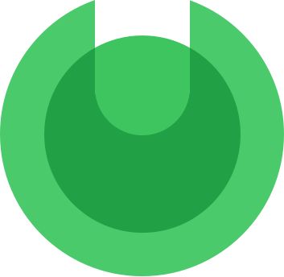

<h1 align="center">Laurel</h1>

<p align="center">
  
</p>

Laurel is an experimental query language. I'm not actively working on it. I expect to add things here and there as inspiration strikes,
and eventually turn it into something I actually use.

Goals:

* Syntax that makes monadic semantics more apparent

  Multisets and lists are two data structures commonly manipulated in query languages such as SQL. These collection types are inherently monadic but SQL obscures this.
  
  A monad `T` has operations `return : a -> T` and `bind : T a -> (a -> T b) -> T b` satisfying the following laws:
  
  * `bind (return x) f = f x` (left identity)
  * `bind ma return = ma` (right identity)
  * `bind (bind ma f) g = bind ma (\a -> bind (f a) g)` (associativity)
  
  In SQL, return is translated as `[[ return x ]] = VALUES( [[ x ]] )`. `bind` is more complicated, using a 
  ["lateral cross join"](https://www.postgresql.org/docs/current/queries-table-expressions.html#QUERIES-LATERAL).
  As an example, `bind (return 1) (\a -> return (a + 1))` translates to `SELECT b.* FROM (VALUES (1)) AS a(it) CROSS JOIN LATERAL (VALUES (a.it + 1)) AS b(it)`.
  What a mouthful! The monad laws cleanly predict the result of the query:
  
  ```
  bind (return 1) (\a -> return (a + 1))
  = { left identity }
  return (1 + 1)
  = { 1 + 1 = 2 }
  return 2
  ```
  
  In other words, that SQL query is equivalent to `VALUES (2)`. I find it way easier to do equational reasoning with a syntax that makes the monad
  laws explicit, rather than whatever arcane stuff is going on in SQL.
  
  In Laurel, `return` is called `yield` and `bind ma (\a -> mb)` is written `for a in ma mb`. The monad laws show up as:
  
  * `for a in (yield x) mb = mb[a := x]` (left identity)
  * `for a in ma yield a = ma` (right identity)
  * `for b in (for a in ma mb) mc = for a in ma for b in mb mc` (associativity)
  
* Left-to-right syntax

  In SQL you write `SELECT t.column1, ..., t.columnN FROM table AS t`, naming the columns before the table. While writing those columns you can't get auto-complete or type checking
  because the tooling won't know which table you're talking about.
  
  In Laurel you write the table before the columns:
  
  ```
  for t in tables.table yield t.{ column1, ..., columnN }  
  ```
  
  In which hypothetical tooling could offer you column name suggestions while you type (cursor represented by `|`):
  
  ```
  for t in tables.table yield t.{ |}

                                     Auto-complete
                                  -------------------
                                  > column1 : Int
                                    column2 : Bool
                                    ...
                                    columnN : String
  ```
  
* More granular types for queries

  I want to use types to differentiate between queries that return a `List`, `Multiset`, or `Set` of rows. Some queries
  even involve `Map`s.
  
  For example, I like to explictly think of SQL's `GROUP BY` as creating a `Map` and then folding each of the
  `Map`'s values. In Laurel, `SELECT category, SUM(cost) FROM transactions GROUP BY category` would be written as
  `tables.transactions group by _.category |> map sum`. `tables.transactions group by _.category` creates a
  `Map String (Multiset Dollars)`, and `map sum` fold each `Multiset Dollars` into a `Dollars` by adding the elements together.

* First class support for algebraic datatypes

  I want to store sum types in my database!
      
* Better code reuse / composition than SQL

* Compile to readable SQL

* Support alternative query targets such as CSV files

* More modern programming syntax

Features (of various levels of completeness):

* Type checker
* Compile to PostgreSQL
* REPL
  * Query CSV files
  * Query live Postgres database 

Inspirations:

* Darwen, H., & Date, C. J. (1995). The third manifesto. ACM Sigmod Record, 24(1), 39-49.

  <https://doi.org/10.1145/202660.202667>
  
* Gibbons, J., Henglein, F., Hinze, R., & Wu, N. (2018). Relational algebra by way of adjunctions. Proceedings of the ACM on Programming Languages, 2(ICFP), 1-28.
  
  <https://doi.org/10.1145/3236781>
  
* [LINQ](https://learn.microsoft.com/en-us/dotnet/csharp/programming-guide/concepts/linq/)